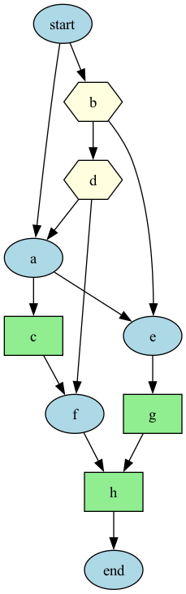

# 🛠️ Playbook

> Playbooks are guardrails for humans

**Playbook** encodes manual workflows into semi-automated processes which provide assistance, checkpoint and tools for a human operator.

It reduces pressure and heat in critical situations by guiding along a proven and tested course of action.

It supports manual approvals, shell commands, and Python functions as workflow steps — making it ideal for operations automation and orchestrated runbooks.

<p align="center">
  
</p>


## 🚀 Features

- Runbook execution from **TOML-defined DAGs**
- **Variable support** with Jinja2 templating for dynamic workflows
- Manual, command, and function nodes
- Rich CLI interface with progress display and user interaction
- Execution state stored in **SQLite** (resumable)
- DAG visualization with **Graphviz**
- Built-in statistics for workflow runs
- Extensible architecture following **Hexagonal Architecture**


## 📦 Installation

Clone this repo and set up a virtual environment:

```bash
pip install playbook
```

Run with:

```bash
playbook --help
```


## 📝 Runbook Format (TOML)

Playbook workflows are defined as TOML files with the following structure:

### Runbook Metadata

```toml
[runbook]
title       = "Example Workflow"
description = "Demonstrates a basic DAG runbook"
version     = "0.1.0"
author      = "tw"
created_at  = "2025-05-03T12:00:00Z"
```

### Node Definition

Each node is a separate TOML table. You define:

- `type`: One of `"Manual"`, `"Command"`, `"Function"`
- `depends_on`: List of upstream node IDs (empty for roots)
- `name`: (Optional) Display name
- `description`: (Optional) Shown in CLI
- Additional fields depend on node type.

#### Manual Node

```toml
[approve]
type         = "Manual"
prompt_after = "Proceed with deployment?"
description  = """This step requires manual approval."""
depends_on   = ["setup"]
skip         = false
critical     = true
```

#### Command Node

```toml
[build]
type         = "Command"
command_name = "make build"
description  = "Build artifacts"
depends_on   = ["setup"]
timeout      = 300
```

#### Function Node

```toml
[notify]
type            = "Function"
function_name   = "playbook.functions.notify"
function_params = { message = "Deployment complete" }
description     = "Notify stakeholders"
depends_on      = ["build", "tests"]
```

### Variables

Make workflows dynamic with variable support. Define variables in a `[variables]` section:

```toml
[variables]
APP_NAME = { default = "myapp", description = "Application name" }
ENVIRONMENT = { required = true, choices = ["dev", "staging", "prod"] }
VERSION = { default = "latest", description = "Version to deploy" }
TIMEOUT = { default = 300, type = "int", min = 60, max = 3600 }

[runbook]
title = "Deploy {{APP_NAME}} to {{ENVIRONMENT}}"
description = "Deploy {{APP_NAME}} version {{VERSION}}"
# ... rest of runbook metadata

[deploy]
type = "Command"
command_name = "kubectl apply -f {{APP_NAME}}-{{ENVIRONMENT}}.yaml"
description = "Deploy {{APP_NAME}} version {{VERSION}} to {{ENVIRONMENT}}"
timeout = "{{TIMEOUT}}"
critical = "truefalse"
depends_on = []
```

#### Variable Sources (Priority Order)
1. **CLI arguments**: `--var ENVIRONMENT=prod --var VERSION=1.2.3`
2. **Variable files**: `--vars-file production.vars.toml`
3. **Environment variables**: `--vars-env PLAYBOOK_VAR_` (loads PLAYBOOK_VAR_*)
4. **Defaults**: From variable definitions in workflow file

#### Jinja2 Features
- **Simple substitution**: `{{VAR_NAME}}`
- **Defaults**: `{{VAR_NAME|default('fallback')}}`
- **Filters**: `{{APP_NAME|upper}}`, `{{SERVICES|join(', ')}}`
- **Conditionals**: `critical`
- **Loops**: `deploy {{service}} && `

### Details and Specification
More info: [DAG.md](doc/DAG.md)


## 🧑‍💻 CLI Usage

### Create a new runbook

```bash
playbook create --title "My Workflow" --author "Your Name"
```

### Validate a runbook

```bash
# Basic validation
playbook validate path/to/runbook.playbook.toml

# Check variable requirements
playbook validate path/to/runbook.playbook.toml --check-vars

# Validate with specific variables
playbook validate path/to/runbook.playbook.toml --var ENVIRONMENT=prod
```

### Execute a workflow

```bash
# Basic execution (prompts for required variables)
playbook run path/to/runbook.playbook.toml

# With CLI variables
playbook run path/to/runbook.playbook.toml --var ENVIRONMENT=prod --var VERSION=1.2.3

# With variable file
playbook run path/to/runbook.playbook.toml --vars-file production.vars.toml

# Non-interactive execution
playbook run path/to/runbook.playbook.toml --vars-file vars.toml --no-interactive-vars
```

### Resume a failed workflow

```bash
playbook resume path/to/runbook.playbook.toml 42
```

### View DAG visualization

```bash
# View and save DAG as PNG (requires Graphviz)
playbook view-dag path/to/runbook.playbook.toml

# Also save DOT file
playbook view-dag path/to/runbook.playbook.toml --keep-dot

# For automation (no auto-open)
playbook view-dag path/to/runbook.playbook.toml --no-open
```

**Note:** DAG visualization requires [Graphviz](https://graphviz.org/download/) to be installed:
- macOS: `brew install graphviz`
- Ubuntu/Debian: `sudo apt-get install graphviz`
- CentOS/RHEL: `sudo yum install graphviz`

### Show run statistics

```bash
playbook info
playbook show "Example Workflow"
```


## 📂 State and Storage

- SQLite DB at `~/.config/playbook/run.db` by default
- Run and node execution state is persisted
- Allows resuming failed runs or inspecting previous ones


## 🧩 Extending

- Add new built-in functions in `playbook/functions.py`
- Add adapters for new persistence/visualization backends
- Follow domain/service/infrastructure boundaries (hexagonal)


## 📚 Example DAG Shape

Example of a DAG with branching, merging, and parallel paths:

```toml
[start]
type = "Command"
command_name = "echo Start"
depends_on = []

[a]
type = "Command"
command_name = "echo A"
depends_on = ["start"]

[b]
type = "Command"
command_name = "echo B"
depends_on = ["start"]

[e]
type = "Command"
command_name = "echo E"
depends_on = ["a", "b"]

[end]
type = "Command"
command_name = "echo End"
depends_on = ["e"]
```


## 🧪 Testing

To run and validate your workflow logic, use:

```bash
pytest tests/
```


## 📖 License

MIT License.  
Copyright © 2025.


## 🧠 Inspiration

This tool is inspired by Airflow, Argo Workflows, and the need for a **lightweight, local-first** DAG executor for operational workflows.
